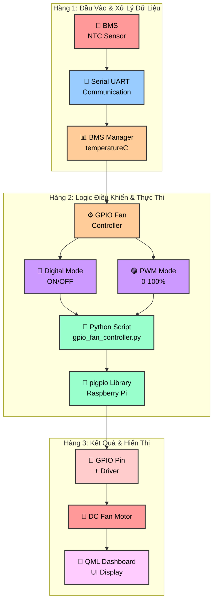

# Luồng Điều Khiển Quạt từ BMS đến GPIO Raspberry Pi

## Sơ đồ Tổng Quát (3 Hàng Ngang)



## Mô tả Chi tiết Luồng

### 1. **Giai đoạn Nhận dữ liệu (Data Acquisition)**
- **BMS** gửi dữ liệu cảm biến NTC (nhiệt độ) qua kết nối **UART**
- Dữ liệu được truyền dưới dạng frame theo **JBD Protocol**

### 2. **Giai đoạn Xử lý Serial (Serial Processing)**
- **BmsSerialReader** nhận dữ liệu từ serial port
- Parse frame theo định dạng JBD, trích xuất dữ liệu nhiệt độ
- Gửi signal `frameReceived()` với dữ liệu đã parse

### 3. **Giai đoạn Quản lý BMS (BMS Management)**
- **BmsManager** nhận frame từ BmsSerialReader
- Cập nhật **BmsSnapshot** với giá trị nhiệt độ (temperatureC)
- Phát signal `snapshotChanged()` để thông báo dữ liệu mới

### 4. **Giai đoạn Điều khiển Quạt (Fan Control Logic)**
- **GpioFanController.updateTemperature()** được gọi với giá trị NTC mới
- **Xác định chế độ:**
  - **Digital Mode**: SO sánh nhiệt độ với ngưỡng ON/OFF (có hysteresis)
  - **PWM Mode**: Tính toán PWM % dựa trên mapping temperature range

### 5. **Giai đoạn Thực thi GPIO (GPIO Execution)**
- Tạo **QProcess** thực thi Python script `gpio_fan_controller.py`
- Script sử dụng **pigpio library** để điều khiển GPIO Raspberry Pi
- Lệnh gửi tới pigpiod daemon

### 6. **Giai đoạn Điều khiển Phần cứng (Hardware Control)**
- **GPIO Pin** được set HIGH/LOW (Digital) hoặc PWM duty cycle
- Điều khiển transistor/MOSFET để cấp nguồn DC fan motor
- Fan quay với tốc độ tương ứng

### 7. **Giai đoạn Phản hồi & Hiển thị (Feedback & Display)**
- GpioFanController phát signal `fanStateChanged()` / `fanSpeedChanged()`
- UI (QML) cập nhật Dashboard hiển thị:
  - Trạng thái fan (ON/OFF)
  - Tốc độ PWM hiện tại (%)
  - Nhiệt độ NTC từ BMS

## Các Threshold & Parameters

### Digital Mode
| Parameter | Giá trị mặc định | Mô tả |
|-----------|-----------------|-------|
| `onTemp` | 40°C | Nhiệt độ bật quạt |
| `offTemp` | 35°C | Nhiệt độ tắt quạt (hysteresis) |

### PWM Mode
| Parameter | Giá trị mặc định | Mô tả |
|-----------|-----------------|-------|
| `minTemp` | 30°C | Bắt đầu PWM từ nhiệt độ này |
| `maxTemp` | 50°C | Đạt 100% PWM ở nhiệt độ này |
| `minPwm` | 20% | PWM tối thiểu khi T ≥ minTemp |
| `maxPwm` | 100% | PWM tối đa khi T ≥ maxTemp |

## Công thức PWM từ Temperature
```
PWM% = max(minPwm, min(maxPwm, (T - minTemp) / (maxTemp - minTemp) * (maxPwm - minPwm) + minPwm))
```

## Các File Chính trong Flow
- **bmsmanager.cpp/h** - Orchestrator chính, quản lý serial + GPIO fan
- **bmsserialreader.cpp/h** - UART communication handler
- **jbdprotocol.cpp/h** - Parse JBD protocol frames
- **bmssnapshot.h** - Data structure chứa nhiệt độ `temperatureC`
- **gpioFanController.cpp/h** - Logic điều khiển quạt (C++)
- **gpio_fan_controller.py** - Thực thi GPIO commands (pigpio)

